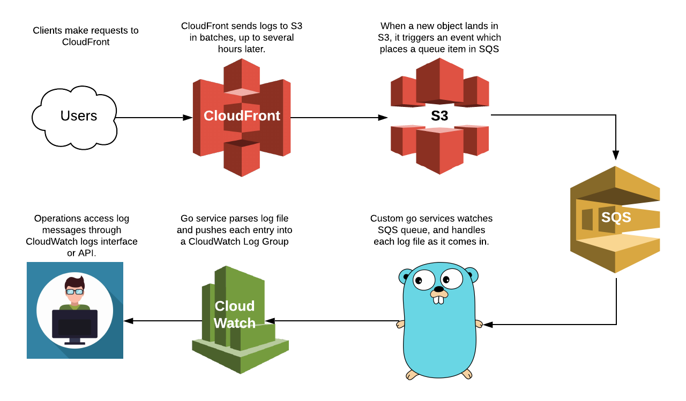

# CloudFront to CloudWatch Logs

Service to synchronise CloudFront logs to CloudWatch.

## Configuration

This tool requires the following cloud resources configured.

* One or more **CloudFront distributions**
    * Must have logging enabled (see notes on s3 bucket below) 
    * Must have tags indicating the log group and log stream. Default tag names are
        * `edge.skpr.io/loggroup` (configurable with `--tag-group` flag)
        * `edge.skpr.io/logstream` (configurable with `--tag-stream` flag)
* A **S3 bucket**
    * Must have event notifications configure to create a SQS message on `s3:ObjectCreated:*` events.
* A **SQS queue**
* **IAM credentials** with IAM policy similar to this:

```json
{
  "Version": "2012-10-17",
  "Statement": [
    {
      "Action": [
        "cloudfront:GetDistribution",
        "cloudfront:GetDistributionConfig",
        "cloudfront:ListDistributions",
        "cloudfront:ListTagsForResource",
        "logs:CreateLogGroup",
        "logs:CreateLogStream",
        "logs:DescribeLogStreams",
        "logs:PutLogEvents",
        "s3:GetBucketNotification",
        "s3:GetObject",
        "sqs:DeleteMessage",
        "sqs:GetQueueUrl",
        "sqs:ReceiveMessage"
      ],
      "Effect": "Allow",
      "Resource": "*"
    }
  ]
}
```

## Usage

**Watch specific distribution**

```bash
cloudfront-cloudwatchlogs watch --distribution [distribution-id] --group [logGroup] --stream [logStream] --region [cloudwatch region]
```

**Discover distributions with cloudwatch tags**

This command responds with json displaying the cloudfront distributions which have tags denoting destination in cloudwatchlogs.

```bash
cloudfront-cloudwatchlogs discover
```

**Discover and Watch**

```bash
cloudfront-cloudwatchlogs discover-watch --region  [cloudwatch region]
```

## Workflow

